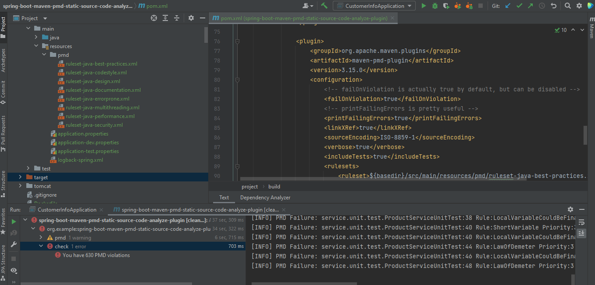

## spring-boot-maven-pmd-static-source-code-analyze-plugin

Purpose : Analyze java source code statically at build time before generating final artifact in your IDE.  
Result : Get detailed report about coding issues such as dead code, empty blocks, unused imports etc.  

### Local run steps  
1- To activate maven pmd plugin run the following maven command :  
NOT : Execute maven command from where the pom.xml is located in the project directory.  
<pre> 
$ mvn clean jxr:jxr install  
</pre>

[INFO] PMD Failure: service.unit.test.ProductServiceUnitTest:38 Rule:LocalVariableCouldBeFinal Priority:3 Local variable 'p1' could be declared final.  
[INFO] PMD Failure: service.unit.test.ProductServiceUnitTest:40 Rule:ShortVariable Priority:3 Avoid variables with short names like p2.  
[INFO] PMD Failure: service.unit.test.ProductServiceUnitTest:40 Rule:LocalVariableCouldBeFinal Priority:3 Local variable 'p2' could be declared final.  
[INFO] PMD Failure: service.unit.test.ProductServiceUnitTest:44 Rule:LawOfDemeter Priority:3 Potential violation of Law of Demeter (method chain calls).  
[INFO] PMD Failure: service.unit.test.ProductServiceUnitTest:46 Rule:LocalVariableCouldBeFinal Priority:3 Local variable 'response' could be declared final.  
[INFO] PMD Failure: service.unit.test.ProductServiceUnitTest:48 Rule:LawOfDemeter Priority:3 Potential violation of Law of Demeter (object not created locally).  
[INFO] ------------------------------------------------------------------------  
[INFO] BUILD FAILURE   
[INFO] ------------------------------------------------------------------------  
[INFO] Total time:  34.803 s  
[INFO] Finished at: 2021-10-02T15:28:18+03:00  
[INFO] ------------------------------------------------------------------------  
[ERROR] Failed to execute goal org.apache.maven.plugins:maven-pmd-plugin:3.15.0:check (default) on project spring-boot-maven-pmd-static-source-code-analyze-plugin: You have 630 PMD violations.  
[ERROR]  

  

### Tech Stack
Java 11  
H2 Database Engine  
spring boot  
spring boot starter data jpa  
spring boot starter web  
spring boot starter test  
hibernate  
logback  
maven  
maven-pmd-plugin  
springfox-swagger-ui  
datasource-proxy  
Docker  
 

### Docker build run steps
NOT : Execute docker commands from where the DockerFile is located.  
<pre>
$ docker system prune  
$ docker build . --tag demo   
$ docker run -p 8080:8080 -e "SPRING_PROFILES_ACTIVE=dev" demo:latest  
</pre>

## API OPERATIONS
### Save store with products successfully to database

Method : HTTP.POST  
URL : http://localhost:8080/customer-info/store/save  

Request : 
<pre>
curl --location --request POST 'http://localhost:8080/customer-info/store/save' \
--header 'Content-Type: application/json' \
--data-raw '{
  "name": "jeans_store",
  "products": [
    {
      "name": "prod1"
    },
    {
      "name": "prod2"
    },
    {
      "name": "prod3"
    }
  ]
}'
</pre> 

Response : 

HTTP response code 200  
<pre>
{
    "id": 1,
    "name": "jeans_store",
    "products": [
        {
            "id": 1,
            "name": "prod3"
        },
        {
            "id": 2,
            "name": "prod1"
        },
        {
            "id": 3,
            "name": "prod2"
        }
    ]
}
</pre>

### List Store saved to database

Method : HTTP.GET  
URL : http://localhost:8080/customer-info/store/list  

Request : 
<pre>
curl --location --request GET 'http://localhost:8080/customer-info/store/list'
</pre> 

Response : 

HTTP response code 200  
<pre>
[
    {
        "id": 1,
        "name": "jeans_store",
        "products": [
            {
                "id": 1,
                "name": "prod3"
            },
            {
                "id": 2,
                "name": "prod1"
            },
            {
                "id": 3,
                "name": "prod2"
            }
        ]
    }
]
</pre> 
